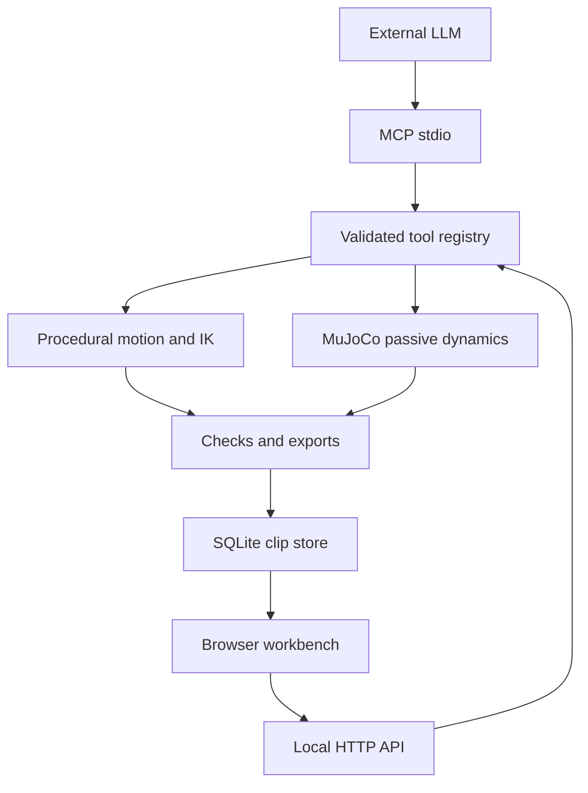

# Architecture and implementation boundaries

Anima 0.3 converts the report's broad research agenda into an executable vertical slice. It intentionally has one engine and one tool registry across all interfaces.

## Modules

| Module | Responsibility |
|---|---|
| `math3d.py` | Vector/quaternion operations, intrinsic XYZ conversion, analytic two-link IK |
| `rigs.py` | Synthetic templates, hierarchy, FK, validated pose angles |
| `motion.py` | Deterministic reference trajectories, gait phases, swing paths, leg IK, jump root trajectory |
| `curves.py` | C2, exact-key scalar/vector animation curves |
| `constraints.py` | Articulated arm model, rigid attachments, reach guards, FK/target/pin validation |
| `serve.py` | Coupled arm/racket reference serve and ball events, used by `generate_motion` |
| `evaluate.py` | Measured geometric and temporal diagnostics; explicitly limited scope |
| `physics.py` | MJCF generation, passive MuJoCo stepping, contacts, joint-to-local rotation extraction |
| `exports.py` | BVH, glTF 2.0 node animation, JSON, MJCF |
| `store.py` | SQLite persistence with independent connections, WAL, atomic object writes |
| `tools.py` | JSON schemas, strict parameter validation, shared operations and compact summaries |
| `mcp.py` | Local stdio MCP lifecycle, discovery, calls, and structured tool errors |
| `server.py` | Local assets, tool API, downloadable exports, same-origin checks |
| `web/viewer.js` | Bundled Three.js preview, mannequin geometry, cameras, shadows and overlays |
| `web/app.js` | Workbench state, generation, inspector, playback, export, tool console |

## Numerical conventions

- Right-handed coordinates: +X right, +Y up, +Z forward. Metres and seconds throughout.
- Joint offsets are in the parent's local frame. A joint's rotation acts on its descendants, not on its own offset.
- FK: `p_child = p_parent + rotate(q_parent_world, offset)`; `q_child_world = q_parent_world * q_child_local`.
- Quaternion storage is XYZW. MuJoCo uses WXYZ; the adapter converts explicitly.
- Local intrinsic XYZ rotations compose `qx * qy * qz`. BVH channel order matches this convention.
- The procedural engine runs at the requested sample rate, up to 240 Hz. The serve shoulder uses explicit swing/twist coordinates; all stored rotations and exports remain XYZW quaternions. Physics integrates at 240 Hz and samples at 24, 30, 60 or 120 Hz.
- Frame zero and the endpoint are both included. A four-second 60 Hz clip has 241 frames.

## Procedural motion

Walk/trot/run controllers produce a phase-indexed foot path. During stance, the foot's forward position cancels root travel, so its world position is fixed. Swing uses a cubic Hermite forward curve and a squared-sine lift. Hermite endpoint velocities preserve zero world foot velocity at lift-off and touchdown. Root height is adjusted for two-link reach and leg angles are solved analytically. The generator rejects rotations outside the template's configured limits.

A short Fourier fit creates a smooth periodic root-height curve below the limb-reach envelope; a conservative offset preserves reach after smoothing. This avoids the sharp height-derivative changes introduced by choosing the lowest supporting-leg height independently each frame.

Human arm swing, waving, breathing and squatting are analytic patterns. Human run is a faster flight-phase reference, not a force-driven running simulation. Jump flight uses `h(t) = v*t - g*t²/2`, with take-off speed set by requested apex height. Crouch and landing remain authored transitions; full-body momentum and muscle-force feasibility are not solved.

The approximate COM uses masses assigned at joint positions. It is not derived from validated segment centroids or an anatomical mesh. Its overlay and distance-to-contact diagnostic must not be interpreted as a balance certificate.

## Physics boundary

The optional MuJoCo backend builds articulated bodies, capsule/sphere colliders, constrained hinge joints and a free root. The ground plane is rotated for this app's Y-up convention. Contact masks allow ground/body interaction and disable self-collision. Rigs have synthetic mass distribution and geometry-derived inertia. The passive test includes a small initial tilt and optional drop height; no motors or balance forces are supplied.

Physics returns actual simulated poses, contact counts, peak contact-force magnitude and warning counters. A collapse or sliding result is shown rather than concealed by a procedural fallback. Geometric checks may flag ground penetration or sliding because contact constraints are compliant and the body is falling. They use joint-sphere approximations, not all collision-geometry surfaces.

The next dynamics milestone is a separate controlled-tracking backend with actuator limits and task-specific stability tests. It should not overwrite or relabel this passive benchmark.

## Tool and storage boundary

Tools reject unknown fields, non-finite numbers, invalid enums, impossible lengths, out-of-range pose angles and unsupported species/actions. Each saved clip embeds its immutable rig snapshot, parameters, frame data, backend label, and evaluation. A new take gets a new identity. SQLite allows a viewer process and MCP process to share an explicit project data directory.

MCP tool calls return compact metadata. `get_clip` supports slices of at most 120 frames. The local viewer reads an entire bounded clip through its application API. Calls are synchronous and generation is bounded to 15 seconds of motion; physics to 5 seconds. There is no remote worker fleet, asynchronous job queue, multi-user authorization, or cloud deployment.

## Extension points

- Add motion providers behind a new tool or explicit `backend` option. Never silently replace a requested unavailable backend.
- Add imported rigs as a separately validated schema, with axis/unit normalization before FK.
- Add validation fixtures from licensed reference data. Preserve raw errors and per-task acceptance criteria instead of combining unrelated errors into a made-up realism score.
- Add whole-body optimization and force-driven tracking while retaining reference and simulated trajectories for comparison.
- Add mesh/skin assets independently of kinematic node export.

## Upstream references

Implementation checked against primary documentation:

- [MuJoCo 3.3.7 Python API](https://mujoco.readthedocs.io/en/3.3.7/python.html): model/data construction, stepping, state access.
- [MuJoCo 3.3.7 XML reference](https://mujoco.readthedocs.io/en/3.3.7/XMLreference.html): generated MJCF is additionally checked by actual model compilation in tests.
- [MCP 2025-06-18 transports](https://modelcontextprotocol.io/specification/2025-06-18/basic/transports): newline-delimited stdio, clean stdout, stderr diagnostics.
- [MCP 2025-06-18 tools](https://modelcontextprotocol.io/specification/2025-06-18/server/tools): discovery, input schemas, structured outputs and tool-level errors.

The bundled renderer is Three.js 0.180.0 under its included MIT license. The version is pinned and bundled for reproducible offline loading after extraction. MuJoCo remains an optional separately installed dependency.

## Recorded-motion path

`recorded.py` loads a bundled, attributed 180 Hz marker array, fits a rigid skeleton, constrains the racket through the hand, and resamples local quaternions. `load_recording` routes through the same Store, evaluator, MCP/HTTP registry, viewer and exporters as other clips. Source positions and fit residuals remain separately identified. Marker-based motion is not passed through the authored serve's easing curves. Gaze and ball reconstruction do not alter the measured racket trajectory. The viewer treats the capture as a one-shot take. Runtime code requires only Python's standard library.
